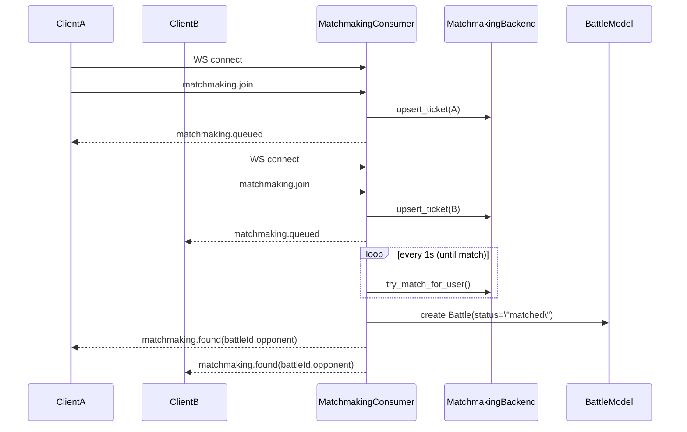
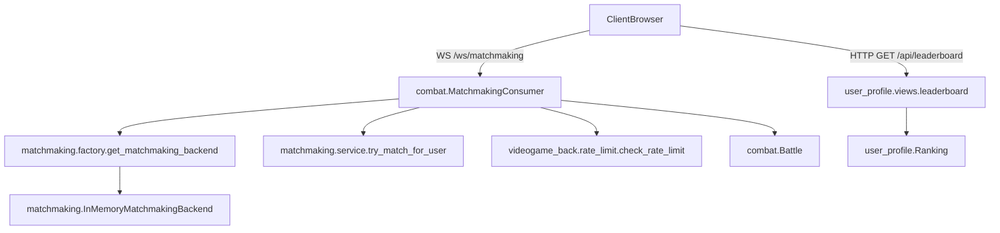

# ELO Matchmaking + Leaderboard + Rate Limiting
## Overview
This feature introduces:
- **WebSocket matchmaking** prioritized by similar ELO (user level).
- **Dynamic threshold expansion**: the acceptable ELO difference grows as the
  player waits (every 10 seconds).
- **Leaderboard endpoint** returning users ordered by ELO (highest first).
- **Reusable backend rate limiting** usable by WebSocket and HTTP endpoints.
## What was introduced
- **WebSocket entrypoint**
  - **Path**: `ws://<host>:<port>/ws/matchmaking`
  - **Consumer**: `backend/videogame_back/combat/consumers.py`
  - **Routing**
    - `backend/videogame_back/combat/routing.py`
    - `backend/videogame_back/videogame_back/routing.py`
    - ASGI wiring in `backend/videogame_back/videogame_back/asgi.py`
- **Matchmaking service (in-memory, Redis-oriented design)**
  - **Package**: `backend/videogame_back/combat/matchmaking/`
  - **Backend interface**: `backend.py`
  - **In-memory backend**: `in_memory_backend.py`
  - **Backend factory**: `factory.py` (switchable via `MATCHMAKING_BACKEND`)
  - **Core algorithm**: `service.py`
- **Leaderboard**
  - **Endpoint**: `GET /api/leaderboard` (no trailing slash)
  - **View**: `backend/videogame_back/user_profile/views.py`
  - **URLs**: `backend/videogame_back/user_profile/urls.py`
  - **Wiring**: `backend/videogame_back/videogame_back/urls.py`
- **Rate limiting**
  - **Module**: `backend/videogame_back/videogame_back/rate_limit.py`
  - **WS usage**: enforced in `MatchmakingConsumer` for `matchmaking.join`
## Data sources
- **Canonical ELO**
  - Stored at `user_profile.models.Ranking.elo`.
  - If a user does not have a `Ranking` row, one is created with default ELO
    (currently 1000).
## How matchmaking works (behavior)
### Client messages
- **Join queue**
```json
{ "type": "matchmaking.join" }
```
- **Cancel queue**
```json
{ "type": "matchmaking.cancel" }
```
### Server messages
- **Queued acknowledgement**
```json
{ "type": "matchmaking.queued", "elo": 1000 }
```
- **Match found**
```json
{
  "type": "matchmaking.found",
  "battleId": 123,
  "opponent": { "userId": 42, "elo": 1015 }
}
```
- **Rate limited**
```json
{ "type": "rate_limited", "message": "Too many requests" }
```
### Matching algorithm
- Each queued player has an **acceptable ELO range** that grows with time.
- The backend searches for the **closest ELO opponent** within that range.
- If matched:
  - Both tickets are removed from the queue.
  - A `Battle` row is created with `status="matched"`.
  - Both players are notified through the channel layer.
The range expansion is implemented in
`backend/videogame_back/combat/matchmaking/service.py` with defaults:
- `initial_range = 50`
- `expand_every_seconds = 10`
- `range_step = 50`
- `max_range = 500`
### Queue backend note
The current implementation is **in-memory**, which is suitable for single
process development. For multi-process / multi-instance deployments, switch to
Redis and implement `RedisMatchmakingBackend` while also moving caches and
channel layers to Redis.
## Flow diagram (sequence)

## Component interaction diagram

## Manual testing steps
### 1) Start the backend (ASGI + WebSockets)
- From `backend/`:
```bash
uv run python .\\videogame_back\\manage.py runserver 127.0.0.1:8000
```
Expected startup line includes: `Starting ASGI/Daphne ...`
### 2) Create two users and set ELOs
```bash
uv run python .\\videogame_back\\manage.py shell
```
```python
from django.contrib.auth.models import User
from user_profile.models import Ranking
u1 = User.objects.create_user(username="p1", password="p1pass")
u2 = User.objects.create_user(username="p2", password="p2pass")
Ranking.objects.update_or_create(user=u1, defaults={"elo": 1000})
Ranking.objects.update_or_create(user=u2, defaults={"elo": 1020})
```
### 3) Verify leaderboard
- Request `GET http://127.0.0.1:8000/api/leaderboard`
- Verify users are ordered by `elo` descending.
### 4) Verify matchmaking (two browser sessions)
Because the consumer requires authentication, use two separate sessions:
- Browser session A: login as `p1` (e.g., via `http://127.0.0.1:8000/admin/`)
- Browser session B: login as `p2` (incognito or different profile)
In **each** session console:
```js
const ws = new WebSocket("ws://127.0.0.1:8000/ws/matchmaking");
ws.onmessage = (e) => console.log("msg", e.data);
ws.onclose = (e) => console.log("close", e.code, e.reason);
ws.onerror = (e) => console.log("error", e);
ws.onopen = () => ws.send(JSON.stringify({ type: "matchmaking.join" }));
```
Expected:
- Both receive `matchmaking.queued`
- Both receive `matchmaking.found`
### 5) Verify rate limiting
In one session, send join multiple times quickly:
```js
for (let i = 0; i < 10; i++) {
  ws.send(JSON.stringify({ type: "matchmaking.join" }));
}
```
Expected:
- A `rate_limited` message after the configured limit is exceeded.
